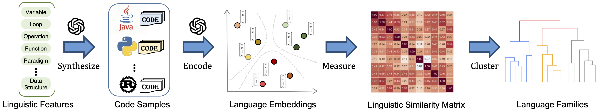

# Beyond Language Boundaries: Uncovering Programming Language Families for Code Language Models

This repo is for the resources of **Beyond Language Boundaries: Uncovering Programming Language Families for Code Language Models**. 

## Summary

The growing diversity of programming languages introduces new challenges for building effective multilingual code large language models (LLMs), particularly in handling language heterogeneity and ensuring cross-language generalization. While most existing approaches simply aggregate code from multiple languages, few consider the deeper linguistic relationships between them—or how these relationships impact model performance.

Our work presents a semantic embedding-based framework to uncover the latent structure and family relationships among 19 popular programming languages, based on 21 carefully designed linguistic features. To evaluate the practical value of these discovered language families, we conduct experiments on three key downstream tasks: transfer learning, curriculum learning, and intermediary code translation. These tasks help us systematically assess how linguistic similarity can guide and improve multilingual LLM training.

## Overview

Our approach systematically uncovers programming language families based on semantic similarities derived from large language model (LLM) embeddings. The end-to-end workflow is illustrated in the figure below and involves the following five stages:



1. **Linguistic Feature Definition**
   We begin by defining 21 core linguistic features (e.g., variable declaration, loops, function returns, typing systems, object-oriented constructs). These features are designed to capture structural and semantic aspects of programming languages.
2. **Code Sample Synthesis**
   For each language-feature pair, we use a prompting framework with GPT-4o to generate functionally consistent, feature-aligned code samples across 19 programming languages. This results in a parallel corpus of 39,900 code snippets.
3. **Embedding Generation**
   The generated code samples are encoded into high-dimensional vectors using OpenAI’s `text-embedding-ada-002` model. For each language, a global embedding is derived by aggregating its feature-level vectors.
4. **Similarity Measurement**
   We compute pairwise cosine similarity between language embeddings to form a linguistic similarity matrix, where higher values indicate stronger semantic alignment.
5. **Hierarchical Clustering**
   Using Ward's linkage algorithm, we cluster languages into families based on the similarity matrix. The resulting dendrogram reveals latent language groupings grounded in shared linguistic properties.

## Repository Structure

This repository contains all code, data, and results required to reproduce the experiments in our paper. Below is an overview of the main directory structure:

```bash
artifact-ase25/
├── code/                        # Source code for feature embedding and clustering
│   ├── sample_generation/       # Scripts for generating feature-aligned code samples with LLMs
│   ├── embeddings/              # Code for computing and aggregating language embeddings
│   └── clustering/              # Clustering and visualization of language families
│
├── data/                        # Datasets used for training and evaluation
│   ├── code_snippets/           # Generated code samples for all 21 features × 19 languages
│   ├── benchmark_transfer/      # Datasets for transfer learning experiments (RQ2.1)
│   ├── benchmark_curriculum/    # Datasets for curriculum learning experiments (RQ2.2)
│   └── benchmark_translation/   # Datasets for intermediary code translation experiments (RQ2.3)
│
├── results/                     # Precomputed experiment results
│   ├── RQ1/                     # Results for language similarity and clustering
│   ├── RQ2_1/                   # Results for transfer learning experiments
│   ├── RQ2_2/                   # Results for curriculum learning
│   └── RQ2_3/                   # Results for intermediary code translation
│
└── README.md                    # Artifact overview

```

## Experimental Results

We evaluate the proposed framework across four code intelligence tasks: code summarization, code search, code generation, and intermediary code translation. Our key findings are as follows:

- **Transfer Learning**: Fine-tuning on Java boosts the BLEU score for Swift code summarization by +19.83%. Similar improvements are observed for other low-resource languages, supporting intra-family knowledge transfer.
- **Curriculum Learning**: A similarity-guided *Near-to-Far* curriculum consistently achieves the highest CodeBLEU scores across 10 languages in code generation tasks, outperforming random and reversed training orders by up to 10% on average.
- **Intermediary Code Translation**: Using Go as a pivot language in Python→X→Y translation leads to a +4.02% increase in average computational accuracy, reinforcing its centrality and bridging capabilities.

These empirical results demonstrate that the discovered programming language families are not only linguistically coherent but also practically effective in guiding multilingual LLM training and inference.

